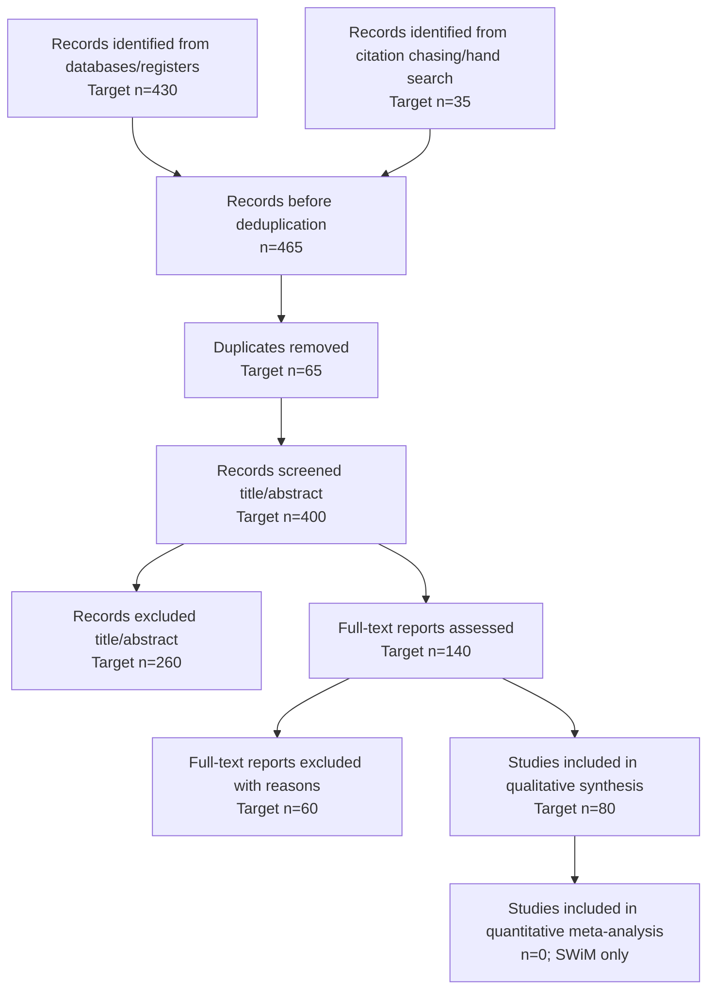

# PRISMA Flow Diagram — Mermaid Template

Replace the target counts with locked database counts after executing the searches.

```mermaid
flowchart TD
A[Records identified from databases/registers\nTarget n=430] --> B[Records before deduplication\nn=465]
A2[Records identified from citation chasing/hand search\nTarget n=35] --> B
B --> C[Duplicates removed\nTarget n=65]
C --> D[Records screened title/abstract\nTarget n=400]
D --> E[Records excluded title/abstract\nTarget n=260]
D --> F[Full-text reports assessed\nTarget n=140]
F --> G[Full-text reports excluded with reasons\nTarget n=60]
F --> H[Studies included in qualitative synthesis\nTarget n=80]
H --> I[Studies included in quantitative meta-analysis\nn=0; SWiM only]
```
